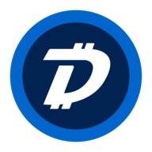

# Introduction

[DigiByte](https://digibyte.io/)\(DGB\) is a [decentralized](https://en.wikipedia.org/wiki/Decentralization) global [UTXO](https://en.wikipedia.org/wiki/Unspent_transaction_output) [PoW](https://en.wikipedia.org/wiki/Proof_of_work) based [blockchain](https://en.wikipedia.org/wiki/Blockchain) \(just like [Bitcoin](https://en.wikipedia.org/wiki/Bitcoin)\) with a focus on [Cyber Security](https://dgbwiki.com/index.php?title=DigiByte_CyberSecurity_Solutions), [DigiAssets](https://dgbwiki.com/index.php?title=DigiAssets), [Payments](https://dgbwiki.com/index.php?title=Payment_Processors) & Secure communications technologies.

The [DigiByte blockchain](https://digibyte.io/#blockchain) was developed in 2013 and released in [January 2014](https://bitcointalk.org/index.php?topic=408268.0) by [Jared Tate](https://dgbwiki.com/index.php?title=Original_author%28s%29) \(Creator & Founder of DigiByte\) with an [open-source protocol](https://osprotocol.com/).

Although based on [Bitcoin](https://en.wikipedia.org/wiki/Bitcoin), adjustments in the code allow for improved functionality, including [15-second block time](https://dgbwiki.com/index.php?title=DigiSpeed), [real-time difficulty adjustment](https://dgbwiki.com/index.php?title=DigiShield) and improved security.

Because of these adjustments in the code, DigiByte is very suitable for facilitating fast and secure transactions.

DigiByte is also the first major Altcoin to successfully [activate SegWit](https://twitter.com/digibytecoin/status/857995712843448320?lang=en) \(April 2017\), [MultiAlgo mining](https://dgbwiki.com/index.php?title=MultiAlgo) \(September 2014\), [DigiShield](https://dgbwiki.com/index.php?title=DigiShield) \(February 2014\) and [Odocrypt](https://dgbwiki.com/index.php?title=Odocrypt) \(July 2019\).

Since 2014, many other blockchains like [Ethereum](https://www.ethereum.org/), [Zcash](https://z.cash/) & [Dogecoin](https://dogecoin.com/) have adopted DigiByte technology such as DigiShield.

DigiByte has never been funded through an [ICO](https://en.wikipedia.org/wiki/Initial_coin_offering), presale or token sale, nor is there a private company controlling the DigiByte Blockchain in line with our vision for a decentralized digital future.

[DGB](https://dgbwiki.com/index.php?title=Cyptocurrency_%28DGB%29) is the [Digital Asset](https://en.wikipedia.org/wiki/Digital_asset) / [Cryptocurrency](https://en.wikipedia.org/wiki/Cryptocurrency) with a 1000:1 ratio to BTC that is being mined over 21 years \(2014-2035\) with a max supply of [21 Billion](https://dgbwiki.com/index.php?title=Why_so_many_coins%3F_21Billion) in the year 2035. When mass adoption arrives, average people can still afford to buy an entire DigiByte.

With [DigiAssets](https://dgbwiki.com/index.php?title=DigiAssets) you can build on top of DigiByte, because it is a secure, scalable secondary layer on top of the global DigiByte blockchain that allows for the [decentralized issuance of assets, tokens, smart contracts, digital identity](https://dgbwiki.com/index.php?title=What_makes_up_the_DigiByte_blockchain%3F) and much more.

DigiByte have had [300,000 + full node downloads](http://www.somsubhra.com/github-release-stats/?username=digibyte&repository=digibyte) since 2017.

As of June 2020 [12,000 active nodes](https://play.google.com/store/apps/details?id=com.noahseidman.digibytenodes) world-wide, [5 parallel cryptographic hashing algorithms](https://dgbwiki.com/index.php?title=DigiByte_Mining_Breakdown) and [real time difficulty adjustment](https://dgbwiki.com/index.php?title=DigiShield) make the network extremely hack resistant.

DigiByte transactions are nearly instantaneous and it takes 15 seconds for a first confirmation, this makes DigiByte 40x faster than [Bitcoin](https://en.wikipedia.org/wiki/Bitcoin) and 10x faster than [Litecoin](https://en.wikipedia.org/wiki/Litecoin).

Thanks to DigiSpeed, DigiByte can [scale on-chain 1066 TPS with SegWit factor](https://dgbwiki.com/index.php?title=DigiSpeed), with fees being as low as 0,000001 USD.

The security of the network, it's incredible speed & low fees makes DigiByte very suitable for performing fast and safe transactions.

It is the world's longest, fastest and one of the most secure UTXO \(Unspent transaction output\) PoW \(Proof of Work\) based blockchain in existence.

