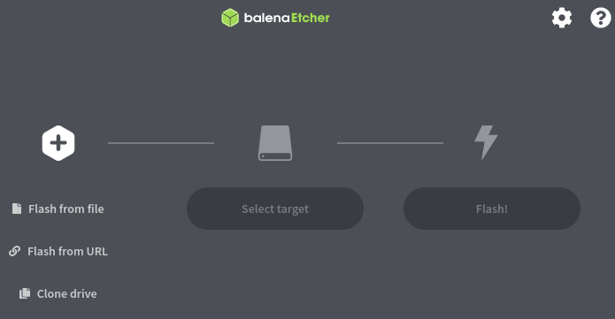

# Run a open full node

## Prerequisites

|  | Minimum \| Recommended |
| :--- | :--- |
| RAM | 4GB minimum \| 8GB recommended |
| Allocation space | 40GB minimum |
| Internet | Decent speed & unlimited bandwidth recommended |


## Linux Servers


The following commands are line based, no GUI is required.



Basic Linux system administration knowledge is assumed and you may need to install additional packages if an error is encountered.


### Swap space

If you are using the minimum of 4GB RAM on your system, it is recommended to have at least 8GB of swap space available. To check the current swap, run the free command.

```text
free -h
```

If you are using the minimum of 4GB RAM on your system, create a swap file with the following commands.


These commands must be performed with root privileges.


```text
fallocate -l 8G /swap
chmod 0600 /swap
mkswap /swap
swapon /swap
```

Use the free command again to verify the changes.

```text
free -h
```

Make the swap changes permanent by adding required information to the fstab file.

```text
echo "/swap swap swap defaults 0 0" >> /etc/fstab
```

### 

### 

### Create user

If a non-root user does not already exist, create the new user name, `digibyte`, and login with the following commands.


These commands must be performed with root privileges.


#### CentOS

```text
useradd -G wheel digibyte -m -s /bin/bash
```

#### Ubuntu

```text
useradd -G sudo digibyte -m -s /bin/bash
```


Set a password for the new user

```text
passwd digibyte
```


Login as user `digibyte`

```text
su - digibyte
```

###  <a id="config-file"></a>

###  <a id="config-file"></a>

### Create config file <a id="config-file"></a>

First create the directory to put the config file in.

```text
mkdir -vp ~/.digibyte
```

Create the basic DigiByte configuration file.

```text
cat <<EOF > ~/.digibyte/digibyte.conf
daemon=1
maxconnections=300
disablewallet=1
EOF
```


Since we are running a server, wallet functionality is disabled with the above config.  
If you want wallet functionality, change the value of `disablewallet on line 4 to` 0.

If your data bandwidth is limited, it is recommended lower the amount of `maxconnections on line` 3.


###  <a id="install-digibyte"></a>

###  <a id="install-digibyte"></a>

### Install DigiByte Core <a id="install-digibyte"></a>

Navigate to your home folder then download and decompress the DigiByte Core software.


If your system is ARM architecture, use the `digibyte-7.17.2-aarch64-linux-gnu.tar.gz` package instead.


```text
cd ~/
wget -c https://github.com/digibyte-core/digibyte/releases/download/v7.17.2/digibyte-7.17.2-x86_64-linux-gnu.tar.gz -O - | tar xz
```

### 

### 

### Add service file


If you don't plan on running DigiByte Core as a service, this step can be skipped.  
Perform this step if you want DigiByte Core to start automatically on system boot.



These commands must be performed with root privileges.


#### CentOS <a id="centos"></a>

```text
cat <<EOF > /usr/lib/systemd/system/digibyted.service
[Unit]
Description=DigiByte's distributed currency daemon
After=network.target

[Service]
User=digibyte
Group=digibyte

Type=forking
PIDFile=/home/digibyte/.digibyte/digibyted.pid
ExecStart=/home/digibyte/digibyte-7.17.2/bin/digibyted -daemon -pid=/home/digibyte/.digibyte/digibyted.pid \
-conf=/home/digibyte/.digibyte/digibyte.conf -datadir=/home/digibyte/.digibyte -disablewallet

Restart=always
PrivateTmp=true
TimeoutStopSec=60s
TimeoutStartSec=2s
StartLimitInterval=120s
StartLimitBurst=5

[Install]
WantedBy=multi-user.target
EOF
```


#### Ubuntu

```text
cat <<EOF > /etc/systemd/system/digibyted.service
[Unit]
Description=DigiByte's distributed currency daemon
After=network.target

[Service]
User=digibyte
Group=digibyte

Type=forking
PIDFile=/home/digibyte/.digibyte/digibyted.pid
ExecStart=/home/digibyte/digibyte-7.17.2/bin/digibyted -daemon -pid=/home/digibyte/.digibyte/digibyted.pid \
-conf=/home/digibyte/.digibyte/digibyte.conf -datadir=/home/digibyte/.digibyte -disablewallet

Restart=always
PrivateTmp=true
TimeoutStopSec=60s
TimeoutStartSec=2s
StartLimitInterval=120s
StartLimitBurst=5

[Install]
WantedBy=multi-user.target
EOF
```


Enable the service on boot.

```text
systemctl enable digibyted.service
```

Start the service.

```text
systemctl start digibyted.service
```


### Run your node

If you haven't already started your DigiByte Core open full node as a service from the previous step, start your node using the following commands.

```text
cd ~/digibyte/digibyte-7.17.2/bin/
./digibyted &
```


The ampersand \(&\) in line `2` above is optional and makes the process run in the background



### Checking log file

You can check the logs of your DigiByte Core open full node with the tail command.

```text
tail -f ~/.digibyte/debug.log
```

### 

### 

### 

### Upgrade tip

Make future upgrades easier by creating a symbolic link and pointing it to the current DigiByte directory.

```text
cd ~/
ln -s digibyte-7.17.2 digibyte
```

In the service file you created, replace any occurrences of `/home/digibyte/digibyte-7.17.2/` with `/home/digibyte/digibyte/` 

_When the time for upgrade comes, stop the `digibyted.service`, download and decompress the new release, delete and re-create the symbolic link pointing to the new DigiByte directory and start the `digibyted.service`._

\_\_

\_\_

\_\_

\_\_

\_\_

\_\_

\_\_

## _Raspberry Pi 4_ <a id="rpi-4"></a>


It's always recommended to have active fan cooling on your Raspberry Pi 4.


### 

### Prerequisites

|  |  |
| :--- | :--- |
| micro SD card | 64GB recommended |
| Hardware | A computer with installed and usable Linux, macOS or Windows |
| Disk image | 64-bit disk image for rpi4, [Ubuntu Server](https://ubuntu.com/download/raspberry-pi) is recommended and will be used in this guide. |
| Software | You will need a software to flash the SD card with, [Balena Etcher](https://www.balena.io/etcher/) will be used in this guide. |
| Internet | Connection through ethernet cable \(WiFi can be used but setup is not covered in this guide\) |

### 

### Prepare the SD card

_It's time to flash the SD card with our 64-bit disk image.  
You can do this in a variety of ways, but throughout this guide we will be using Balena Etcher to flash our SD card._

_\*\*\*\*_

_**Balena Etcher**_


_Balena Etcher is a third-party software and is not provided by DigiByte or the contributors of this wiki._


Download and open the Balena Etcher software_**.**_



Click on **Flash from file** and select your disk image. 

**Select target**, the SD card, and then click on the **Flash!** button.

Your SD card is now ready.


### Set up the RPi <a id="setup-rpi"></a>


The following commands are line based, no GUI is required.


Connect a keyboard, mouse & display to your RPi.  
Insert the SD card and boot your device.


#### Log in <a id="rpi-log-in"></a>

Login with the default credentials, since we're using Ubuntu Server our default username and password is `ubuntu` . On first login you will be prompted to change the password.

Upgrade your system to latest using the following command.

```text
sudo apt update && sudo apt upgrade -y
```

Wait for it to finish, then restart your system.

```text
sudo reboot
```

 


The rest of the steps in this RPi 4 guide can be completed using [SSH](https://www.openssh.com/manual.html).


### 

### Swap space

If you are using the minimum of 4GB RAM on your system, it is recommended to have at least 8GB of swap space available. To check the current swap, run the free command.

```text
free -h
```

If you are using the minimum of 4GB RAM on your system, create a swap file with the following commands.


These commands must be performed with root privileges.


```text
fallocate -l 8G /swap
chmod 0600 /swap
mkswap /swap
swapon /swap
```

Use the free command again to verify the changes.

```text
free -h
```

Make the swap changes permanent by adding required information to the fstab file.

```text
echo "/swap swap swap defaults 0 0" >> /etc/fstab
```


### Create config file <a id="config-file-rpi4"></a>

First create the directory to put the config file in.

```text
mkdir -vp ~/.digibyte
```

Create the basic DigiByte configuration file.

```text
cat <<EOF > ~/.digibyte/digibyte.conf
daemon=1
maxconnections=300
disablewallet=1
EOF
```


Since we are running a server, wallet functionality is disabled with the above config.  
If you want wallet functionality, change the value of `disablewallet on line 4 to` 0.

If your data bandwidth is limited, it is recommended lower the amount of `maxconnections on line` 3.



### Install DigiByte Core

Navigate to your home folder then download and decompress the DigiByte Core software. 

```text
cd ~/
wget -c https://github.com/digibyte-core/digibyte/releases/download/v7.17.2/digibyte-7.17.2-aarch64-linux-gnu.tar.gz -O - | tar xz
```


### Add service file


If you don't plan on running DigiByte Core as a service, this step can be skipped.  
Perform this step if you want DigiByte Core to start automatically on system boot.



These commands must be performed with root privileges.


```text
cat <<EOF > /etc/systemd/system/digibyted.service
[Unit]
Description=DigiByte's distributed currency daemon
After=network.target

[Service]
User=digibyte
Group=digibyte

Type=forking
PIDFile=/home/digibyte/.digibyte/digibyted.pid
ExecStart=/home/digibyte/digibyte-7.17.2/bin/digibyted -daemon -pid=/home/digibyte/.digibyte/digibyted.pid \
-conf=/home/digibyte/.digibyte/digibyte.conf -datadir=/home/digibyte/.digibyte -disablewallet

Restart=always
PrivateTmp=true
TimeoutStopSec=60s
TimeoutStartSec=2s
StartLimitInterval=120s
StartLimitBurst=5

[Install]
WantedBy=multi-user.target
EOF
```


Enable the service on boot.

```text
systemctl enable digibyted.service
```

Start the service.

```text
systemctl start digibyted.service
```

###  <a id="install-digibyte"></a>


### Run your node

If you haven't already started your DigiByte Core open full node as a service from the previous step, start your node using the following commands.

```text
cd ~/digibyte/digibyte-7.17.2/bin/
./digibyted &
```


The ampersand \(&\) in line `2` above is optional and makes the process run in the background



### View log file

You can check the logs of your DigiByte Core open full node with the tail command.

```text
tail -f ~/.digibyte/debug.log
```

### 

### 

### 

### Upgrade tip

Make future upgrades easier by creating a symbolic link and pointing it to the current DigiByte directory.

```text
cd ~/
ln -s digibyte-7.17.2 digibyte
```

In the service file you created, replace any occurrences of `/home/digibyte/digibyte-7.17.2/` with `/home/digibyte/digibyte/` 

_When the time for upgrade comes, stop the `digibyted.service`, download and decompress the new release, delete and re-create the symbolic link pointing to the new DigiByte directory and start the `digibyted.service`._


## _Port forwarding_

_A DigiByte open full node requires port `12024` on your router to be opened, a process called_ [_port forwarding_](https://en.wikipedia.org/wiki/Port_forwarding)_._


_Without the port forwarded you can not relay the blockchain to other nodes and can't be found on the network._



### Find your LAN IP <a id="get-lan-ip"></a>

A local area network \(LAN\) IP, is the IP address your network devices use to communicate with each other in their local environment, e.g those devices connected to your router.  
We're going to tell the router to forward the incoming traffic of port `12024` to this IP address.

_**Select your OS from the tabs below.**_




You need the `net-tools` package for the following step.  
It can be installed with `sudo apt install net-tools`


Find your LAN IP using the ifconfig command.

```text
ifconfig
```

You will receive an output that looks something like in the code block below.

```text
enp0s25: flags=4099<UP,BROADCAST,MULTICAST>  mtu 1500
        ether 00:26:18:55:bd:77  txqueuelen 1000  (Ethernet)
        RX packets 0  bytes 0 (0.0 B)
        RX errors 0  dropped 0  overruns 0  frame 0
        TX packets 0  bytes 0 (0.0 B)
        TX errors 0  dropped 0 overruns 0  carrier 0  collisions 0
        device interrupt 20  memory 0xfbcc0000-fbce0000  

lo: flags=73<UP,LOOPBACK,RUNNING>  mtu 65536
        inet 127.0.0.1  netmask 255.0.0.0
        inet6 ::1  prefixlen 128  scopeid 0x10<host>
        loop  txqueuelen 1000  (Local Loopback)
        RX packets 13178  bytes 1129714 (1.1 MB)
        RX errors 0  dropped 0  overruns 0  frame 0
        TX packets 13178  bytes 1129714 (1.1 MB)
        TX errors 0  dropped 0 overruns 0  carrier 0  collisions 0

wlxf81a6718dc39: flags=4163<UP,BROADCAST,RUNNING,MULTICAST>  mtu 1500
        inet 10.0.0.169  netmask 255.0.0.0  broadcast 10.255.255.255
        inet6 fe80::89fe:fe67:4f60:826c  prefixlen 64  scopeid 0x20<link>
        ether f8:1a:67:18:dc:39  txqueuelen 1000  (Ethernet)
        RX packets 92321  bytes 82390304 (82.3 MB)
        RX errors 0  dropped 0  overruns 0  frame 0
        TX packets 72648  bytes 9875771 (9.8 MB)
        TX errors 0  dropped 0 overruns 0  carrier 0  collisions 0
```

One line 1, 9 & 18, we are seeing interface names.   
These might be named something different for you.

What we are looking for is a local IP address on a line that starts with `inet`.

In order, we can first see the ethernet interface which does not have an `inet` address, so in this case this interface can be ignored.

The next interface, the `lo`, is a typical interface called the `loopback` , this can also be ignored since it it only provides us with a localhost IP.

The next interface we see is a wireless device interface, because this system is connected through WiFi.  
If we look on line `19` above, we can find what we are looking for and see that our local IPv4 address is `10.0.0.169`.



In the top left corner of your desktop, click the **Apple** icon -&gt; **System** **Preferences**.

Click on **Network**

Select your connection device \(WiFi or Ethernet\) to reveal your LAN IP address.



Open up a run window by pressing the keyboard shortcut `Start + R`  and entering `cmd` in the text field, click OK. A **cmd** window will appear.

Use the **ipconfig** command.

```text
ipconfig
```

The address will be the IPv4 address in the listed output.




### Forward port

1. Go to your routers local IP address in a web browser and login with sufficient privileges.
2. Select the **TCP** protocol.
3. Enter port `12024` into the port field.
4. Enter your DigiByte Core open full node's LAN IP address into the IP address field.
5. Save your changes.


There's a lot of different routers with a lot of different user interfaces. It is very hard to make a generic guide for a subject like port forwarding, fortunately enough portforward.com offers guides for some of the most common brands.

If you don't know how to port forward your router, try finding your router brand and model on the link below.




